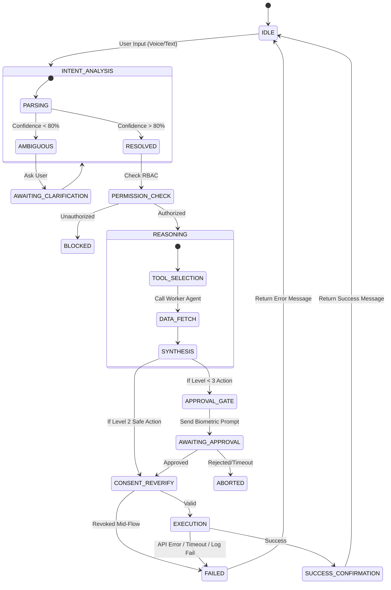

# Tech Spec: Supervisor State Machine & Data Policies

> **Status:** CANONICAL — v2.1 (Phase 1, Launch Ready); implementation depth added by the frozen P0 specs · **Author:** Alfred (Lead Product Architect) · **Last content change:** 2026-02-13
> **Canonical copy.** Recovered on 2026-09-16 from the claude.ai project "FamilyLife OS" knowledge file `Tech_Spec_Supervisor_State_Machine_v2_1.md.docx` (the text claude.ai extracted from the Word file, kept verbatim in `archive/claude-project-exports/`). Content is unchanged; Markdown formatting was normalised (tables, list wrapping, escaped characters).
> **Cited elsewhere as:** FSM v2.1, Tech_Spec_Supervisor_State_Machine_v2_1, FSM spec §n.
> **Note:** §1.4 (Healer every 15 minutes) is a placeholder superseded by Tech_Spec_Financial_Transaction_Safety v1.1 (every 5 minutes). §3 TTL policy and §4 idempotency keys are referenced verbatim by the frozen specs. The tracker lists the known gaps (error transition matrix, concurrency control, TTL enforcement mechanism, journal schema).

**Status:** Phase 1 (Launch Ready v2.1)

**Purpose:** To define the deterministic behavior of the Supervisor Agent ("The Brain") and the data freshness rules for the FamilyLifeOS Kernel.

## 0. Document Governance

| **Version** | **Date** | **Description of Change** | **Author** |
|---|---|---|---|
| v1.0 | 2026-02-13 | Initial Tech Spec definition (FSM, Tiers, TTL). | Alfred |
| v2.0 | 2026-02-13 | Execution Release (FAILED state, Metadata). | Alfred |
| v2.1 | 2026-02-13 | **Refinement Release:** Added Reconciliation Worker and Consent Re-verification step. | Alfred |

## 1. Supervisor Finite State Machine (FSM)

The Supervisor is not a stateless LLM call. It is a **Stateful Orchestrator**. It must persist its state across network calls and user interruptions.

### 1.1. The State Diagram

### 1.2. State Definitions

1. **IDLE:** Listening for "Wake Word" or Push Notification triggers. Low power consumption.

2. **INTENT_ANALYSIS:** Converting NLP tokens into a structural intent (e.g., PAY_BILL {amount: 500, biller: BESCOM}).

3. **AWAITING_CLARIFICATION:** The system pauses and explicitly asks the user for missing info. *State must persist if user closes app.*

4. **REASONING:** The "Thinking" phase. The Supervisor queries Worker Agents (Health, Finance).

5. **AWAITING_APPROVAL:** A critical holding state. The system has prepped the transaction (UPI Intent created) but is blocked until Biometric Auth is received.

6. **CONSENT_REVERIFY:** A mandatory check immediately before execution to ensure the AA/ABHA Consent Handle hasn't been revoked in the last few seconds. Prevents "Time-of-Use" race conditions.

7. **EXECUTION:** The irreversible commitment of the action (sending the API call to BBPS/ONDC).

8. **FAILED:** A distinct state for system errors (500s, timeouts, denials). Used for Observability/Telemetry to distinguish from user aborts.

### 1.3. Persistence Layer

- **Storage:** Redis (Hot State) + PostgreSQL (Journal).

- **Recovery:** If the server crashes during AWAITING_APPROVAL, the system rehydrates the state from Redis. **Supervisor always reconciles state from PostgreSQL journal on boot** to handle Redis data loss/volatility.

### 1.4. Background Reconciliation (The Healer) [Phase 1.1]

- **Placeholder:** A cron job running every 15 minutes to check for transactions marked "Executed but Unconfirmed" (Zombie States). It verifies status with the external provider (UPI/BBPS) and repairs the Audit Log or issues a refund request.

## 2. Automation Tiers (The "Leash")

To ensure human sovereignty, every action is classified into a tier.

| **Tier** | **Name** | **Behavior** | **Examples** |
|---|---|---|---|
| **Level 0** | Manual | User initiates, User executes. Agent only navigates UI. | Add Member, Delete Module. |
| **Level 1** | Assisted | Agent prepares, User approves. | Pay Bill > ₹100, Share Medical Record. |
| **Level 2** | Semi-Auto | Agent executes within pre-set safe limits, notifies User. | Replenish Milk (<₹100), Pay Recurring Subscriptions. |
| **Level 3** | Autonomous | Agent executes silently. (**Forbidden in V1**). | Investing in Stocks, Booking Flights without asking. |

## 3. Data Freshness & Caching Policy (TTL)

We cannot make financial decisions on stale data. All cached objects **MUST** include metadata: fetched_at, source_api, and expires_at.

### 3.1. Time-To-Live (TTL) Standards

| **Data Type** | **Source** | **TTL (Cache Duration)** | **Refresh Logic** |
|---|---|---|---|
| **Bank Balance** | Account Aggregator | 15 Minutes | Force fetch on any "Pay" intent. |
| **Bill Dues** | BBPS | 24 Hours | Nightly Cron Job. |
| **Health Records** | ABHA | 7 Days | Fetch only on demand (User Query or Doctor Visit). |
| **School Circulars** | School API/Email | 12 Hours | Parse twice daily (Morning/Evening). |
| **Inventory** | HomeOps (Local) | Indefinite | Updates only on User Action or Order Fulfillment. |

### 3.2. Stale Data Handling

- **Graceful Warning:** If User asks "Can we afford a vacation?" and Bank Data is >15 mins old but fetch fails, Supervisor says: *"Based on your balance as of 2 hours ago..."*

- **Hard Stop:** If User tries to "Pay Bill" and Balance is stale/fetch fails, the system **blocks** the transaction to prevent overdraft fees.

## 4. Idempotency Keys

To prevent double-spending during network flakiness:

- **Format:** UUID_v4 generated at the start of INTENT_ANALYSIS.

- **Scope:** Every EXECUTION call to a Worker Agent must include this Idempotency-Key.

- **Behavior:** If FinanceAgent receives the same Key twice, it returns the *previous* success result without re-executing the UPI call.

- **Storage:** Idempotency Key must be persisted to the DB **before** the external API call is attempted.
